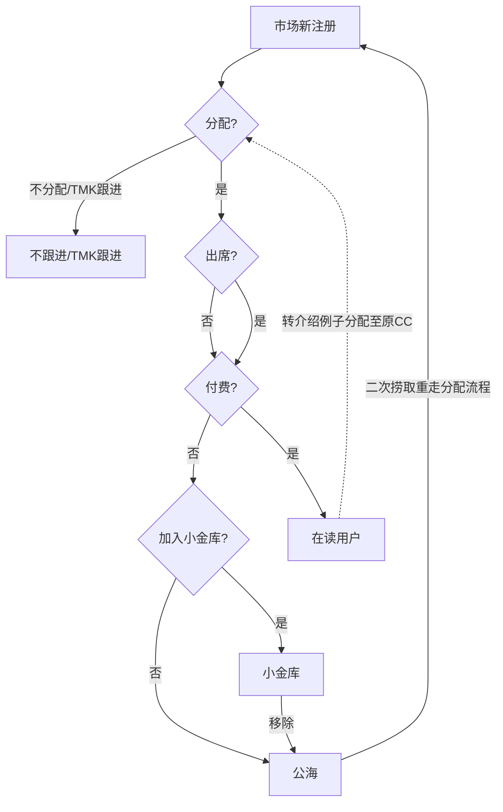

# Leads Distribution & Lifecycle Process
# 市场线索流转规则说明

---

## 一、流程图概览

---

## 二、名词与规则说明

### 1. 注册Leads分类
- **市场例子**：按运营配置的分配规则进行分配。
- **转介绍例子**（含CC宅口径、SS宅口径、宽口径）：优先分配给原CC。

---

### 2. Leads掉落规则
当Leads在某个CC名下超过系统配置时间，若无出席/付费等行为，将自动掉落至公海：
- 分配后 N 天未出席 → 掉落公海
- 出席后 N 天未付费 → 掉落公海

> 注：N为可配置天数，修改前必须联系运营中台确认。

---

### 3. 小金库（Private Pool）
- 核心特性：**无视Leads掉落规则**，无人工干预永不掉落。
- 容量限制：每个CC有一定限额，当前通常上限为 **70条**。
- 权限控制：SD及以上角色不开通小金库功能。

---

### 4. 公海（Public Pool）
- 公海中的数据可被CC自由捞取跟进。
- 数据排序：按渠道、是否出席、被跟进次数等维度由大数据赋分，**分值高的数据优先显示**。
- 捞取规则：单次捞取数量有上限；捞取后须全部更新备注，方可进行下次捞取。

---
